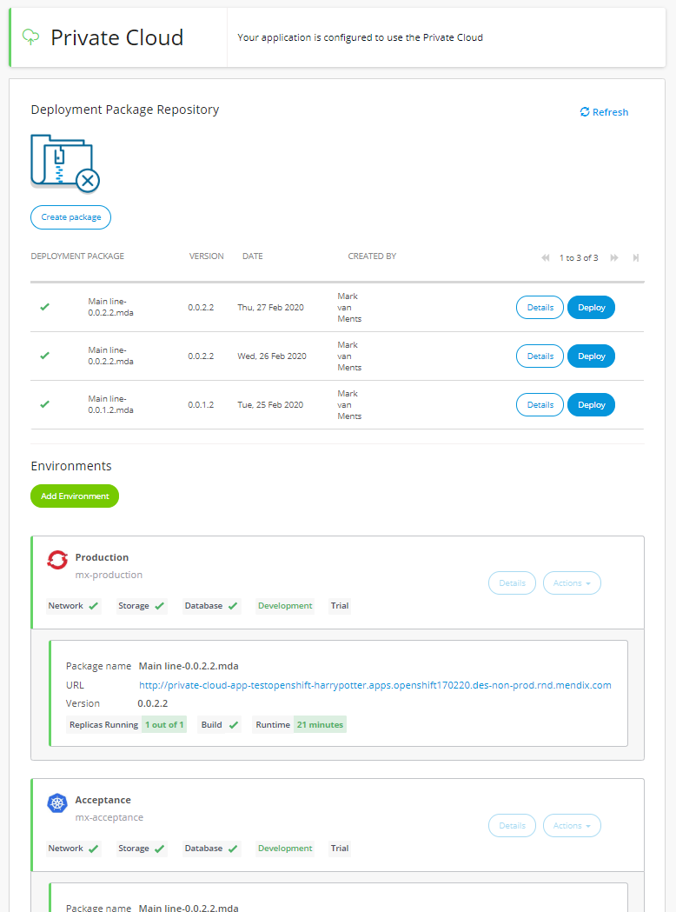
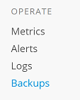
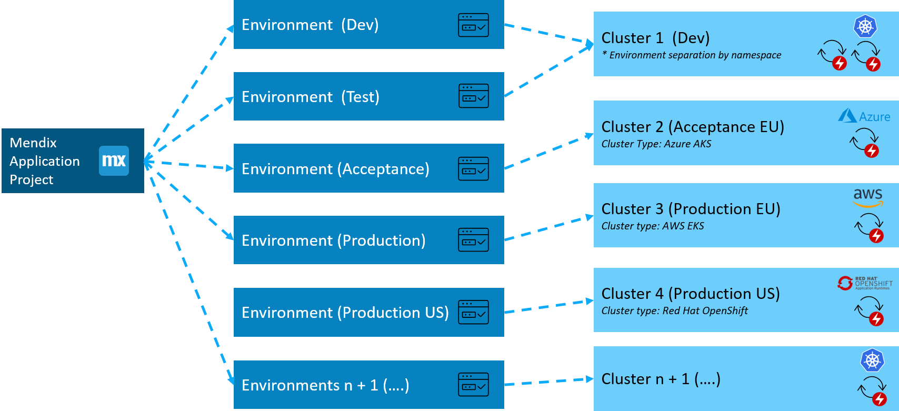

## 1 What Features Are Available in the Mendix for Private Cloud {#MX4PC}

Mendix For Private Cloud provides the 'LowOps' 1-click deployment experience known by Mendix on your own Kubernetes based (virtual) private cloud solution.

Allowing Mendix Development teams to manage their application lifecyle, (Dev, Test, Acceptance, Prduction, ... ) without the need of direct access to their Kuberentes infrastructure or having knowledge on Kubernetes.

The expericenc includes also the ablity to access directly the logging and Metrics solution connected to the Kubernetes clusters. 

Next to the infrastructure provided backup's, a developer will be able to create and restore an adhoc Backup's of his application. 

For Kubernetes Administrators the solution will provide a single initialization script to run on the Kubernetes cluster to install the necessary Mendix for Private Cloud components.

## 2 How Does Application Deployment Management Work?

Mendix for Private Cloud can be used in combination with the  Mendix Online Deployment Portal experience giving the Mendix developer full control of his application lifecycle. The portal will send messages to the Kubernetes cluster which will trigger the cluster to download the necessary artifacts to build and deploy the application.

For the **Standalone** version of Mendix for Private Cloud, normal Kubernetes Mendix CR's can be applied to the Kubernetes API, to initiate the provisioning and deployment of an application. This is optimal in combination with a CI/CD solution. 

For more information on Standalone usage see [How can I use Mendix for Private Cloud Standalone?](#standalone)

## 3 What is the architecture of Mendix for Private Cloud? 

Mendix for Private Cloud is based on the Kubernetes native operator architecture. The Mendix operator is responsible for deployment, provisioning, backup/recovery, scaling and building of the Mendix application. By appling a Mendix Custom resource to the Kubernetes API, the Operation will perform all necessary task to run the applciation in an HA configuration.
  

To make it possible to provide the Mendix Deployment experience using the **"Connected"** Mendix Deployment portal, a secure tunnel will be established initiated from the Private Cloud to the Mendix Online Deployment portal. The Mendix Gateway installed in the Kubernetes cluster is responsible for setting up this tunnel without the need of opening ports on the Firewall of the private cloud.

An Mendix Operator has only rights to perform actions in its own namespace. Applications deployed by the operator will be deployed within the same namespace as the operator. 

## 4 Can I use Mendix For Private Cloud Standalone? {#standalone}

In case corporate policies won't allow it to have a online connection to the private cloud, it is possilbe to use "Mendix For Private Cloud" in **Standalone** mode. In this situation the developer will not be able to use the online portal to manage his applications, but I has to use a self provided CI/CD solution to create the Mendix Custom Resource for a new version of the Mendix Application. 

Typical in in these circumstances a local source code repository used as well for the Models of the Mendix Application. By creating a CI/CD pipeline which 'OnCommit' creates the Mendix CR the integartion is estalished. 

## 5 How can I create an adhoc Backup of my Application when using Mendix for Private Cloud?

It is possilbe to create a adhoc backup of both the files as the database of the application. This can be used to move data from one environment to the other or to roll-back an earlier made deployment. 

The backup functionality can be found under the **Operate** header within the App menu of the Online Portal. 

 

For the standalone version a backup can be triggered by providing a Mendix CR for the Backup. 

## 6 How can I scale my application within Mendix For Private Cloud? 

## 7 How can I run an application on Multiple Cloud using Mendix for Private Cloud?

With Mendix for Private Cloud it is possible to create multiple environments for an application within difference physical Kubernetes Clusters. E.g. I could create a development environment on Azure AKS and a Production environment on RedHat OpenShift for the same application.

## 8 How can I manage the authorisation of my (Virtual) Private Cloud  

Mendix for Private Cloud defines three standard roles. A Cluster Administrator, Cluster Manager and a developer. 

An Cluster Administrator is responsibe for the first time setup of Mendix for Private Cloud on a Kubernetes clusters. An Administrator asignes a Manager on the cluster who can delegate access to the cluster to other developers. 

For a developer it is possilbe to setup fine graded access management, like some developer may only scale, or view metrics. 

