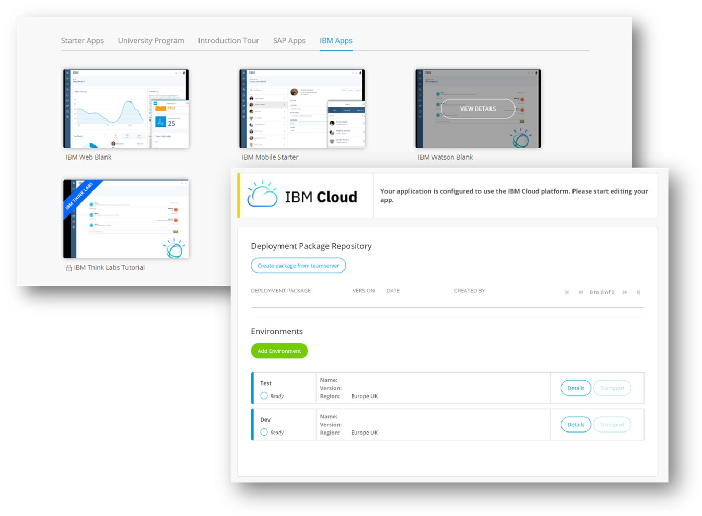

## 1 How Does Mendix Run on the SAP Cloud Platform? {#running-sap-cloud}

The SAP Cloud Platform is available in two development environments: SAP Neo and SAP Cloud Foundry (which is their newest option). Mendix is integrated with the SAP Cloud Foundry environment.

A Mendix application is deployed by the Mendix Development Portal using the Mendix Cloud Foundry buildpack. The data of the application is stored in either an SAP HANA or a Postgresql database running on a cloud provider like AWS or Azure. Optionally, a storage service is attached to allow the storage of files. By default the application is integrated with the SAP authentication and authorization service, and a connectivity service.

Based on the cloud-native architecture of the Mendix application as well as the Cloud Foundry capabilities, a Mendix app running on the SAP Cloud Platform is fully high-available, and it supports vertical, horizontal, and auto scaling.

## 2 How Is the Mendix Development Portal Integrated with the SAP Cloud Platform?

The deployment of a Mendix application to the SAP Cloud Platform is completely integrated in the application lifecycle of Mendix.

As soon as you are ready to run your app, you can visit the Mendix Developer Portal to transport the app to the SAP Cloud Platform. The Developer Portal will perform all the actions required to set up your application and run it on the SAP Cloud Platform.

You can use the Mendix Development Portal to control the app items below within the SAP Cloud Platform:

* Sizing
* Application constants
* Scheduled events
* Deployments
* Status

{}

{}

This video presents how you can create an environment;

<video controls src="attachments/CreateAnEnvironment.mp4">VIDEO</video>

## 3 How Can I Run in High Availability Mode on the SAP Cloud Platform?

You can run a Mendix application in high availability on the SAP Cloud Platform via the scaling option. By creating more than one instance of your app, the app will automatically start running in high availability.

## 4 Does Mendix Have Auto-Scaling Support on the SAP Cloud Platform?

The SAP Cloud Platform has a service that provides auto-scaling capabilities. It has two methods for auto-scaling an application:

* The service can increase or decrease the amount of running container instances of the application based on application dynamics like memory, throughput, or response time, or
* The service can auto-scale based on a schedule

A Mendix app has full support to work with this service in order to optimize resource utilization and performance reliability.

## 5 How Can I Use SAP Cloud Platform's Authentication & Authorization Service to Enable SSO for My Mendix App?

Within the SAP Cloud Platform, it is possible to connect your own identity provider (IDP) for managing the user authentication and authorization of your apps running on the SAP Cloud Platform. A Mendix app supports this service out of the box. During deployment of the Mendix app, the authentication and authorization service (XSUAA Connector for SAP Cloud Platform) is automatically bound to the app. The Mendix app will use this service to provide an SSO experience with your IDP.

For more details, see [How to Use the XSUAA Connector for SAP Cloud Platform](https://docs.mendix.com/partners/sap/use-sap-xsuaa-connector) in the *Mendix Strategic Partners Guide*.

## 6 How Do I Connect My Mendix App with My On-Premises SAP System When Running on SAP Cloud Platform?

To extend your on-premises SAP system, a secure connection is required between the SAP Cloud Platform and your premises. This is done via the SAP Cloud Connector, which is installed on your premises in order to create a secure tunnel between your premises and the SAP Cloud Platform.

When deploying a Mendix application on the SAP Cloud Platform, the SAP Connectivity service is automatically bound to your app. This service provides the necessary information to the Mendix app for it to use the tunnel and connect to your on-premises system.

## 7 How Can I Set Up Principal Propagation Between My Mendix App & the SAP Back-End?

The SAP Cloud Connector must be configured for principal propagation with the back-end system, which is a standard operation within the SAP Cloud Connector. For the developer of the Mendix app, no effort is required.

For details on this integration, see the section [How Does Mendix Support Principal Propagation Between My Mendix Application and the SAP Back-End System?](../strategic-partners/sap-integration#principal) in *SAP Integration*.

## 8 How Can I Run Mendix on IBM Cloud? {#ibm-cloud}

IBM has endorsed Mendix has their low-code development platform on top of IBM Cloud. This partnership brings seamless integration between Mendix Platform and IBM Cloud.

IBM Cloud can be selected within the Cloud Settings of your app, so you can deploy your application with 1-click to the IBM Cloud. IBM Cloud is selected by default when selecting one of the IBM Starter apps.

IBM Cloud integration provided within the Mendix Developer Portal is based on IBM Cloud, Cloud Foundry. 
